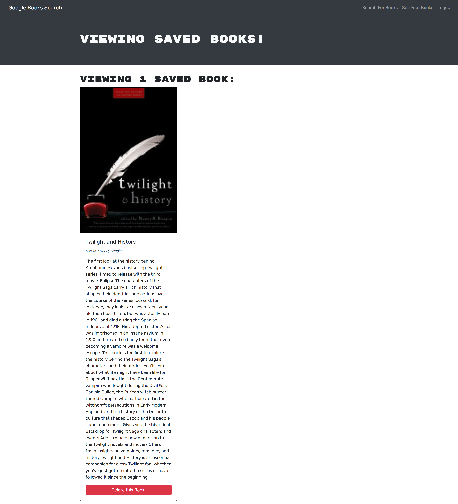

# book-search-engine

## Description

Book search application built using MERN stack and Google Books API. Allows users to save book searches.

## Installation

To install necessary dependencies, run the following command:

```sh
npm install
```

## Usage

- Set required environment variables:
  - `AUTH_SECRET` (random string)
- Run `npm run build` to build the React front-end code.
- Run `npm start` to start the application.

## Technologies used

- React
- GraphQL
- MongoDB
- Express

## Live URL and screenshot

Live URL: <https://anisha-google-book-search.herokuapp.com/>



## License

[](https://opensource.org/licenses/MIT)

## Helpful resources

- <https://coding-boot-camp.github.io/full-stack/mongodb/deploy-with-heroku-and-mongodb-atlas>
